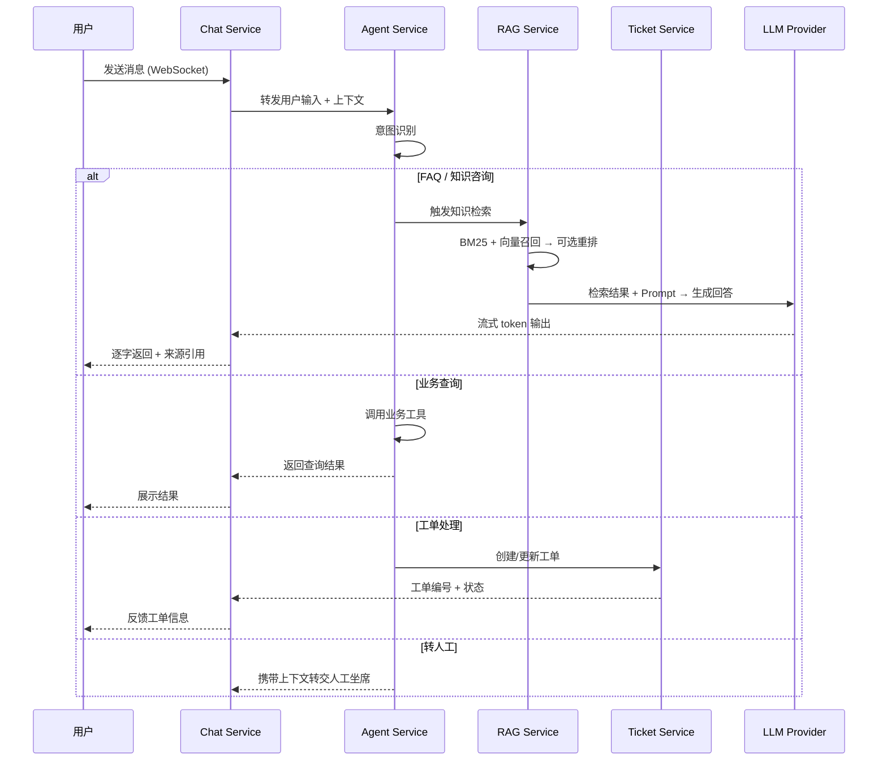

# PRD：AskFlow — 智能客服系统（RAG + Agent）

> 文档更新时间：2026-04-06
>
> 说明：本 PRD 描述产品目标与目标架构。当前仓库的实现状态请查看 `docs/status/PROJECT_STATUS.md`。为避免文档漂移，本版已同步仓库当前采用的前端与 Agent 落地方案：前端使用 React 19 + Vite，Agent 编排当前使用自定义 `AgentGraph`。

## 1. 项目概览

### 1.1 背景

当前客服系统主要依赖人工处理 FAQ、工单分发和问题跟进，存在以下问题：

1. 重复问题占比高，人工回答成本高
2. 知识分散在文档、FAQ、历史工单中，新人上手慢
3. 用户提问方式不固定，传统关键词检索命中率低
4. 复杂问题需多环节流转，处理链路长，效率不稳定

AskFlow 是一套基于 **RAG + Agent** 的智能客服系统，将“找知识、识别意图、路由流程、处理工单”串联为自动化闭环，减少人工重复劳动，同时保证私有知识可控、不外泄。

### 1.2 核心目标

- 基于私有知识库的精准问答
- 多意图识别与任务路由
- 实时流式回复
- 复杂工单的自动化闭环处理

### 1.3 业务指标

一期上线后目标：

| 指标 | 目标值 |
|------|--------|
| FAQ 类问题自动解答率 | ≥ 70% |
| 知识检索命中准确率 | ≥ 85% |
| 平均首次响应时间降低 | 60% |
| 人工客服重复问题处理量降低 | 50% |
| 复杂工单自动分流成功率 | ≥ 80% |

## 2. 用户角色

### 2.1 外部用户

发起咨询的终端用户，关注回复速度、答案准确性和对话连续性。

### 2.2 客服人员

处理系统未覆盖问题、人工介入复杂工单、维护知识内容。

### 2.3 运营 / 知识管理员

负责知识库更新、意图分类维护、流程配置、效果分析。

### 2.4 系统管理员

负责权限配置、日志审计、服务监控和部署运维。

## 3. 系统架构

### 3.1 架构总览

系统采用分层架构，自上而下分为接入层、网关层、服务层、数据层四层：

```
┌─────────────────────────────────────────────────────────┐
│                      接入层 Clients                      │
│       Web (React 19 + Vite) · 移动端 · 第三方集成        │
└──────────────────────────┬──────────────────────────────┘
                           │ WebSocket / HTTPS
┌──────────────────────────▼──────────────────────────────┐
│                    网关层 API Gateway                    │
│        认证鉴权 · 限流 · 路由转发 · 请求日志             │
└──────────────────────────┬──────────────────────────────┘
                           │
┌──────────────────────────▼──────────────────────────────┐
│                      服务层 Services                     │
│                                                         │
│  ┌─────────────┐  ┌─────────────┐  ┌─────────────┐     │
│  │ Chat Service│  │ RAG Service │  │Agent Service │     │
│  │  会话管理    │  │  检索 & 生成 │  │ 意图 & 路由  │     │
│  │  流式输出    │  │  文档处理    │  │ 工具调用     │     │
│  └──────┬──────┘  └──────┬──────┘  └──────┬──────┘     │
│         │                │                │             │
│  ┌──────┴──────┐  ┌──────┴──────┐  ┌──────┴──────┐     │
│  │Ticket Svc   │  │Embedding Svc│  │Admin Service │     │
│  │ 工单管理     │  │ 向量化 & 索引│  │ 后台管理     │     │
│  └─────────────┘  └─────────────┘  └─────────────┘     │
└──────────────────────────┬──────────────────────────────┘
                           │
┌──────────────────────────▼──────────────────────────────┐
│                      数据层 Data                         │
│  PostgreSQL · Redis · ChromaDB · 对象存储（MinIO）       │
└─────────────────────────────────────────────────────────┘
```

### 3.2 服务拆分

| 服务 | 职责 | 关键接口 |
|------|------|----------|
| **Chat Service** | WebSocket 连接管理、会话生命周期、流式输出、上下文维护 | `ws://` 对话通道 |
| **RAG Service** | 文档切片、混合检索、Rerank、Prompt 组装、LLM 调用 | 检索问答 API |
| **Agent Service** | 意图识别、Router Agent 调度、工具调用编排 | 意图分类 API、路由决策 API |
| **Ticket Service** | 工单创建、状态流转、去重、通知 | 工单 CRUD API |
| **Embedding Service** | 文档解析、分块、向量化、索引构建与更新 | 索引管理 API |
| **Admin Service** | 知识库管理、意图配置、Prompt 模板管理、数据统计 | 管理后台 API |

### 3.3 核心数据流



### 3.4 技术选型

| 技术 | 选型 | 选型理由 |
|------|------|----------|
| **后端框架** | FastAPI | 原生 async/await、WebSocket 支持、自动 OpenAPI |
| **Agent 编排** | 自定义 AgentGraph | 当前实现已落地条件分支与状态传递，后续仍可演进到 LangGraph |
| **向量数据库** | ChromaDB | 轻量、易本地部署、Python 集成简单 |
| **关系数据库** | PostgreSQL | 结构化业务数据存储 |
| **缓存** | Redis | 会话上下文、限流、缓存 |
| **对象存储** | MinIO | 文档原文件存储，S3 兼容 |
| **消息队列** | Redis Streams（目标能力） | 计划用于异步索引与通知 |
| **前端** | React 19 + Vite | 与当前仓库实现一致，开发体验轻量 |
| **通信协议** | WebSocket | 适合流式输出和双向通信 |

### 3.5 部署拓扑

```
┌─── 开发环境 ──────────────────────────────────┐
│  Docker Compose 单机部署                      │
│  FastAPI + ChromaDB + PostgreSQL              │
│  + Redis + MinIO                              │
└───────────────────────────────────────────────┘

┌─── 生产环境（目标）───────────────────────────┐
│  Kubernetes 集群                             │
│  应用层按连接数与 CPU 横向扩展                │
│  外挂 PostgreSQL、Redis、ChromaDB、MinIO      │
└───────────────────────────────────────────────┘
```

## 4. 功能需求

### 4.1 智能问答（RAG）

功能说明：对接私有知识文档，完成切片、向量化、索引构建，结合混合检索增强回答质量。

- 支持自然语言提问与多轮上下文对话
- 检索策略采用 **BM25 + 向量检索** 混合召回，支持可选重排
- 支持按文档来源、时间、标签过滤
- 返回结果附带原文片段与引用来源
- 降低模型幻觉，提升私有知识命中率

### 4.2 意图识别

功能说明：对用户输入进行快速分类，为 Agent 路由提供决策依据。

输入：用户问题 + 历史对话上下文 + 用户身份信息（可选）

输出：意图类别 + 置信度 + 是否需要澄清追问

支持至少 6 类意图：

| 意图 | 示例 |
|------|------|
| FAQ 咨询 | “退货政策是什么？” |
| 产品问题 | “XX 产品支持哪些接口？” |
| 订单 / 工单查询 | “我的订单到哪了？” |
| 故障报修 | “系统登录报 500 错误” |
| 投诉建议 | “服务态度差，要投诉” |
| 人工转接 | “转人工” |

要求：

- 支持规则 + 模型双重识别
- 低置信度结果进行兜底处理（追问或转人工）
- 支持人工后台调整分类标签

### 4.3 Router Agent

功能说明：根据意图调用对应能力链路，而不是将所有问题都直接交给模型回答。

| 意图类型 | 路由目标 |
|----------|----------|
| FAQ / 产品问题 | RAG 检索问答 |
| 订单 / 工单查询 | 工具调用 |
| 故障报修 / 投诉建议 | 工单系统 |
| 人工转接 | Handoff |
| 低置信度 | Clarify |

### 4.4 聊天体验

- WebSocket 流式回复
- 支持取消生成
- 支持心跳保活与自动重连
- 保留近期上下文，维持多轮问答连续性

### 4.5 工单闭环

- 聊天中无法解决的问题可创建工单
- 工单支持去重、状态流转、优先级
- 支持普通用户查看自己的工单
- 支持客服/管理员跟进处理

### 4.6 管理后台

- 知识文档上传、删除、重建索引
- 意图配置管理
- Prompt 模板管理
- 数据统计与效果分析

## 5. 非功能需求

### 5.1 安全

- JWT 认证
- RBAC 权限控制
- 请求限流
- 私有知识不外泄

### 5.2 数据治理

- 关键业务数据持久化
- 敏感信息脱敏存储
- 审计日志可追踪

### 5.3 可观测性

- 结构化日志
- 健康检查
- 指标采集
- 告警和可视化看板

## 6. 验收原则

满足以下条件时，可认为一期目标达成：

1. 用户可完成登录、提问、接收流式回答
2. 系统可基于知识库返回带来源的回答
3. Agent 可根据意图将问题路由到对应链路
4. 用户可创建并查看工单，客服可处理工单
5. 管理端可管理文档、意图，并查看基础统计
6. 系统具备基本认证、限流、健康检查和指标暴露能力
