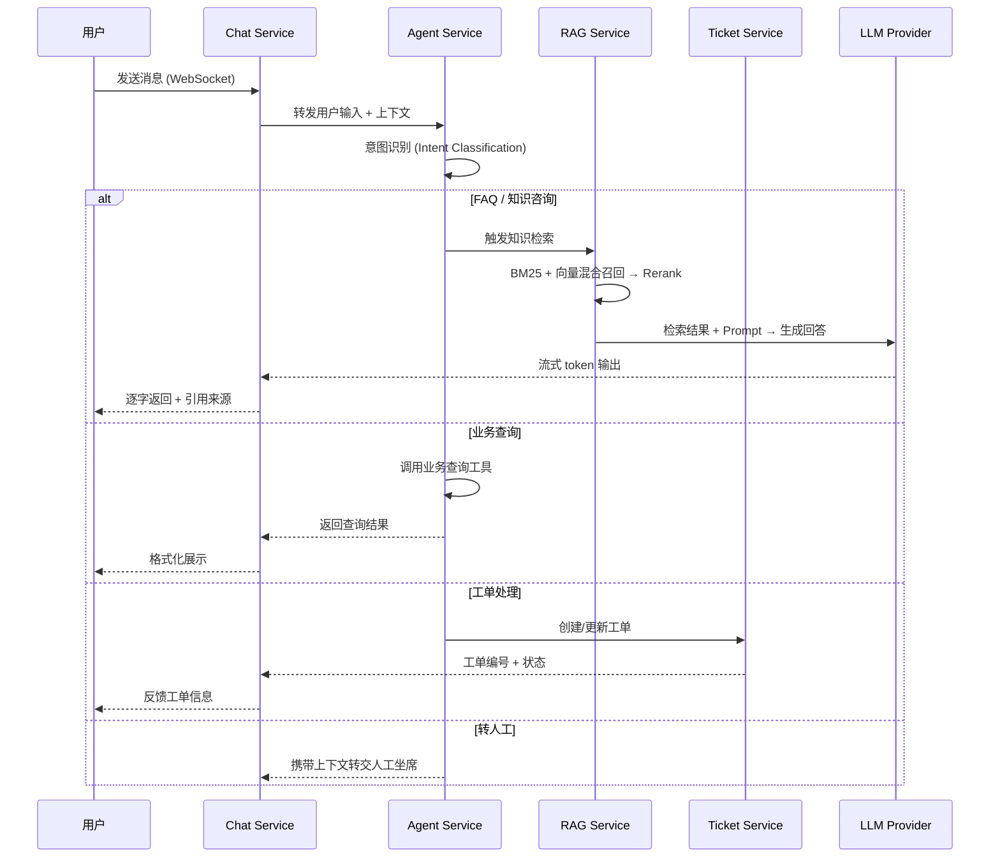

# PRD：AskFlow — 智能客服系统（RAG + Agent）

## 1. 项目概览

### 1.1 背景

当前客服系统主要依赖人工处理 FAQ、工单分发和问题跟进，存在以下问题：

1. 重复问题占比高，人工回答成本高
2. 知识分散在文档、FAQ、历史工单中，新人上手慢
3. 用户提问方式不固定，传统关键词检索命中率低
4. 复杂问题需多环节流转，处理链路长，效率不稳定

AskFlow 是一套基于 **RAG + Agent** 的智能客服系统，将"找知识、识别意图、路由流程、处理工单"串联为自动化闭环，减少人工重复劳动，同时保证私有知识可控、不外泄。

### 1.2 核心目标

* 基于私有知识库的精准问答
* 多意图识别与任务路由
* 实时流式回复
* 复杂工单的自动化闭环处理

### 1.3 业务指标

一期上线后目标：

| 指标                       | 目标值 |
| -------------------------- | ------ |
| FAQ 类问题自动解答率       | ≥ 70%  |
| 知识检索命中准确率         | ≥ 85%  |
| 平均首次响应时间降低       | 60%    |
| 人工客服重复问题处理量降低 | 50%    |
| 复杂工单自动分流成功率     | ≥ 80%  |

---

## 2. 用户角色

### 2.1 外部用户

发起咨询的终端用户，关注回复速度、答案准确性和对话连续性。

### 2.2 客服人员

处理系统未覆盖问题、人工介入复杂工单、维护知识内容。

### 2.3 运营 / 知识管理员

负责知识库更新、意图分类维护、流程配置、效果分析。

### 2.4 系统管理员

负责权限配置、日志审计、服务监控和部署运维。

---

## 3. 系统架构

### 3.1 架构总览

系统采用**分层架构**，自上而下分为接入层、网关层、服务层、数据层四层：

```
┌─────────────────────────────────────────────────────────┐
│                      接入层 Clients                      │
│         Web (Vue 3)  ·  移动端  ·  第三方集成             │
└──────────────────────────┬──────────────────────────────┘
                           │ WebSocket / HTTPS
┌──────────────────────────▼──────────────────────────────┐
│                    网关层 API Gateway                     │
│       认证鉴权 · 限流 · 路由转发 · 请求日志               │
└──────────────────────────┬──────────────────────────────┘
                           │
┌──────────────────────────▼──────────────────────────────┐
│                      服务层 Services                     │
│                                                         │
│  ┌─────────────┐  ┌─────────────┐  ┌─────────────┐     │
│  │ Chat Service│  │ RAG Service │  │Agent Service │     │
│  │  会话管理    │  │  检索 & 生成 │  │ 意图 & 路由  │     │
│  │  流式输出    │  │  文档处理    │  │ 工具调用     │     │
│  └──────┬──────┘  └──────┬──────┘  └──────┬──────┘     │
│         │                │                │             │
│  ┌──────┴──────┐  ┌──────┴──────┐  ┌──────┴──────┐     │
│  │Ticket Svc   │  │Embedding Svc│  │Admin Service │     │
│  │ 工单管理     │  │ 向量化 & 索引│  │ 后台管理     │     │
│  └─────────────┘  └─────────────┘  └─────────────┘     │
└──────────────────────────┬──────────────────────────────┘
                           │
┌──────────────────────────▼──────────────────────────────┐
│                      数据层 Data                         │
│  PostgreSQL  ·  Redis  ·  Milvus  ·  对象存储 (MinIO)    │
└─────────────────────────────────────────────────────────┘
```

### 3.2 服务拆分

| 服务                  | 职责                                                         | 关键接口                   |
| --------------------- | ------------------------------------------------------------ | -------------------------- |
| **Chat Service**      | WebSocket 连接管理、会话生命周期、流式输出、上下文维护       | `ws://` 对话通道           |
| **RAG Service**       | 文档切片、混合检索（BM25 + 向量）、Rerank、Prompt 组装、LLM 调用 | 检索问答 API               |
| **Agent Service**     | 意图识别、Router Agent 调度、工具调用编排                    | 意图分类 API、路由决策 API |
| **Ticket Service**    | 工单创建、状态流转、去重、通知                               | 工单 CRUD API              |
| **Embedding Service** | 文档解析、分块、向量化、索引构建与更新                       | 索引管理 API               |
| **Admin Service**     | 知识库管理、意图配置、Prompt 模板管理、数据统计              | 管理后台 API               |

### 3.3 核心数据流



### 3.4 技术选型

| 技术           | 选型          | 选型理由                                                     |
| -------------- | ------------- | ------------------------------------------------------------ |
| **后端框架**   | FastAPI       | 原生 async/await、WebSocket 支持、自动 OpenAPI 文档生成      |
| **Agent 编排** | LangGraph     | 比 LangChain 更适合有状态的多步骤 Agent 工作流，支持条件分支和循环 |
| **向量数据库** | Milvus        | 生产级向量数据库，支持高可用部署、亿级向量、混合检索，ChromaDB 仅作开发环境替代 |
| **关系数据库** | PostgreSQL    | 工单、用户、会话等结构化数据存储，成熟稳定                   |
| **缓存**       | Redis         | 会话上下文缓存、热门问答缓存、分布式锁、限流计数             |
| **对象存储**   | MinIO         | 知识文档原文件存储，S3 兼容，可平滑迁移云存储                |
| **消息队列**   | Redis Streams | 文档索引异步任务、工单状态变更通知，轻量级，无需额外组件     |
| **前端**       | Vue 3         | 组合式 API、TypeScript 支持、生态成熟                        |
| **通信协议**   | WebSocket     | 流式输出、双向通信、断线重连                                 |

### 3.5 部署拓扑

```
┌─── 开发环境 ──────────────────────────────────┐
│  Docker Compose 单机部署                       │
│  FastAPI + Milvus Standalone + PostgreSQL      │
│  + Redis + MinIO                               │
└───────────────────────────────────────────────┘

┌─── 生产环境 ──────────────────────────────────┐
│  Kubernetes 集群                               │
│  ┌──────────┐  ┌──────────┐  ┌──────────┐    │
│  │ Ingress  │  │ Service  │  │ Milvus   │    │
│  │ (Nginx)  │→ │ Pods x N │  │ Cluster  │    │
│  └──────────┘  └──────────┘  └──────────┘    │
│  ┌──────────┐  ┌──────────┐  ┌──────────┐    │
│  │ PG HA    │  │ Redis    │  │ MinIO    │    │
│  │ (主从)   │  │ Sentinel │  │ Cluster  │    │
│  └──────────┘  └──────────┘  └──────────┘    │
│  水平扩展：Service Pods 按 CPU/连接数自动伸缩   │
└───────────────────────────────────────────────┘
```

---

## 4. 功能需求

### 4.1 智能问答（RAG）

**功能说明**：对接本地知识文档，完成切片、向量化、索引构建，结合混合检索增强回答质量。

* 支持自然语言提问与多轮上下文对话
* 检索策略采用 **BM25 + 向量检索** 混合召回，支持 Rerank 排序
* 支持按文档来源、时间、标签过滤
* 返回结果附带原文片段与引用来源
* 降低模型幻觉，提升私有知识命中率

### 4.2 意图识别

**功能说明**：对用户输入进行快速分类，为 Agent 路由提供决策依据。

**输入**：用户问题 + 历史对话上下文 + 用户身份信息（可选）

**输出**：意图类别 + 置信度 + 是否需要澄清追问

支持至少 6 类意图：

| 意图            | 示例                    |
| --------------- | ----------------------- |
| FAQ 咨询        | "退货政策是什么？"      |
| 产品问题        | "XX 产品支持哪些接口？" |
| 订单 / 工单查询 | "我的订单到哪了？"      |
| 故障报修        | "系统登录报 500 错误"   |
| 投诉建议        | "服务态度差，要投诉"    |
| 人工转接        | "转人工"                |

**要求**：

* 支持规则 + 模型双重识别
* 低置信度结果进行兜底处理（追问或转人工）
* 支持人工后台调整分类标签

### 4.3 Router Agent

**功能说明**：根据意图调用对应能力链路，不直接回答所有问题。

| 意图类型       | 路由目标         |
| -------------- | ---------------- |
| FAQ / 知识咨询 | RAG Service 问答 |
| 业务查询       | 业务系统查询接口 |
| 工单处理       | Ticket Service   |
| 高风险 / 敏感  | 转人工坐席       |
| 低置信度       | 追问补充信息     |

**要求**：

* 路由决策过程可记录、可审计
* 每条流程有明确兜底规则
* 支持配置化扩展，不依赖硬编码

### 4.4 对话与流式响应

**功能说明**：前后端通过 WebSocket 建立长连接，支持流式回复。

* 打字机式逐字输出
* 中途取消生成
* 断线自动重连 + 会话状态恢复
* 多轮上下文管理
* 心跳检测（30s 间隔）

**技术实现**：

* 后端基于 FastAPI WebSocket
* 封装统一连接管理类 `ChatWebSocket`
* WebSocket 消息协议见 §6.2

### 4.5 工单处理

**功能说明**：无法直接回答或需进入业务流程时，自动生成工单并跟踪状态。

**流程**：识别问题 → 收集必要字段 → 生成工单 → 路由处理人/系统 → 状态回传用户

**要求**：

* 工单去重（相同用户 + 相同问题 24h 内不重复创建）
* 支持补充信息追问
* 状态变更通知（WebSocket 推送 + 可选邮件）
* 支持人工接管

### 4.6 后台管理

* 知识库上传与更新（支持 PDF、Markdown、Word、HTML）
* 意图分类配置（增删改 + 启用/禁用）
* Prompt 与流程模板管理（版本化）
* 日志监控与问答效果分析（命中率、满意度、响应时间趋势）

---

## 5. 非功能需求

### 5.1 性能

| 指标                  | 要求                            |
| --------------------- | ------------------------------- |
| 单轮问题平均响应时间  | < 3s                            |
| 首 token 返回时间     | < 1s                            |
| 并发 WebSocket 连接数 | ≥ 500（单实例），水平扩展无上限 |
| 知识检索 P99 延迟     | < 500ms                         |

### 5.2 安全

* 私有知识仅在本地向量库内检索，不发送至外部
* 敏感数据脱敏存储（手机号、身份证等）
* 接口鉴权（JWT）与 RBAC 访问控制
* 对话日志支持审计追踪
* API 限流：单用户 60 req/min

### 5.3 可用性与降级

| 场景           | 降级策略                                   |
| -------------- | ------------------------------------------ |
| LLM 服务不可用 | 返回检索原文片段 + 提示"AI 回答暂时不可用" |
| 向量库不可用   | 降级为 BM25 关键词检索                     |
| Agent 路由异常 | 默认走 RAG 问答链路                        |
| WebSocket 断连 | 客户端自动重连，服务端恢复会话上下文       |
| 服务可用性目标 | ≥ 99.9%                                    |

### 5.4 可观测性

* **日志**：结构化 JSON 日志，包含 trace_id 贯穿全链路
* **指标**：Prometheus 采集，Grafana 看板（QPS、延迟、错误率、检索命中率）
* **告警**：错误率 > 5% 或 P99 > 5s 时触发告警

### 5.5 可扩展性

* 支持新增知识源（API、数据库、网页抓取）
* 支持新增意图分类（后台配置，无需重新部署）
* 支持新增 Agent 工具和业务流程（插件化注册）
* 支持切换 LLM / Embedding 模型（配置化，支持多模型并存）

---

## 6. 数据模型与接口

### 6.1 核心数据模型

**会话 (Conversation)**

| 字段       | 类型      | 说明                          |
| ---------- | --------- | ----------------------------- |
| id         | UUID      | 主键                          |
| user_id    | VARCHAR   | 用户标识                      |
| status     | ENUM      | active / closed / transferred |
| created_at | TIMESTAMP | 创建时间                      |
| updated_at | TIMESTAMP | 更新时间                      |
| metadata   | JSONB     | 扩展信息                      |

**消息 (Message)**

| 字段            | 类型      | 说明                      |
| --------------- | --------- | ------------------------- |
| id              | UUID      | 主键                      |
| conversation_id | UUID      | 所属会话                  |
| role            | ENUM      | user / assistant / system |
| content         | TEXT      | 消息内容                  |
| intent          | VARCHAR   | 识别到的意图              |
| confidence      | FLOAT     | 意图置信度                |
| sources         | JSONB     | 引用来源列表              |
| created_at      | TIMESTAMP | 创建时间                  |

**工单 (Ticket)**

| 字段            | 类型      | 说明                                     |
| --------------- | --------- | ---------------------------------------- |
| id              | UUID      | 主键                                     |
| conversation_id | UUID      | 关联会话                                 |
| user_id         | VARCHAR   | 发起用户                                 |
| type            | VARCHAR   | 工单类型                                 |
| status          | ENUM      | pending / processing / resolved / closed |
| priority        | ENUM      | low / medium / high / urgent             |
| assignee        | VARCHAR   | 处理人                                   |
| content         | JSONB     | 工单详情                                 |
| created_at      | TIMESTAMP | 创建时间                                 |
| resolved_at     | TIMESTAMP | 解决时间                                 |

**知识文档 (Document)**

| 字段        | 类型      | 说明                         |
| ----------- | --------- | ---------------------------- |
| id          | UUID      | 主键                         |
| title       | VARCHAR   | 文档标题                     |
| source      | VARCHAR   | 来源标识                     |
| file_path   | VARCHAR   | 原文件存储路径               |
| status      | ENUM      | indexing / active / archived |
| chunk_count | INT       | 分块数量                     |
| tags        | JSONB     | 标签列表                     |
| created_at  | TIMESTAMP | 创建时间                     |
| indexed_at  | TIMESTAMP | 最近索引时间                 |

### 6.2 WebSocket 协议

**客户端 → 服务端**

```json
{
  "type": "message | cancel | ping",
  "conversation_id": "uuid",
  "content": "用户输入文本",
  "timestamp": 1710000000
}
```

**服务端 → 客户端**

```json
{
  "type": "token | message_end | error | intent | source | ticket | pong",
  "conversation_id": "uuid",
  "data": {
    "content": "逐字内容 (type=token) 或完整结构化数据",
    "sources": [{"title": "...", "chunk": "...", "score": 0.92}],
    "intent": {"label": "faq", "confidence": 0.95},
    "ticket_id": "uuid"
  },
  "timestamp": 1710000000
}
```

### 6.3 核心 REST API

| 方法   | 路径                                   | 说明             |
| ------ | -------------------------------------- | ---------------- |
| POST   | `/api/v1/conversations`                | 创建会话         |
| GET    | `/api/v1/conversations/{id}/messages`  | 获取会话消息历史 |
| POST   | `/api/v1/tickets`                      | 创建工单         |
| GET    | `/api/v1/tickets/{id}`                 | 查询工单状态     |
| PUT    | `/api/v1/tickets/{id}`                 | 更新工单         |
| POST   | `/api/v1/admin/documents`              | 上传知识文档     |
| DELETE | `/api/v1/admin/documents/{id}`         | 删除知识文档     |
| POST   | `/api/v1/admin/documents/{id}/reindex` | 重建索引         |
| GET    | `/api/v1/admin/intents`                | 获取意图分类列表 |
| PUT    | `/api/v1/admin/intents/{id}`           | 更新意图配置     |
| GET    | `/api/v1/admin/analytics`              | 获取效果分析数据 |

---

## 7. 用户流程

### 7.1 FAQ 问答

用户提问 → Agent 判断为 FAQ → RAG 混合检索 → LLM 组织答案 → WebSocket 逐字返回 → 展示引用来源

### 7.2 业务查询

用户提问 → Agent 判断为查询类 → Router 调用业务查询接口 → 格式化结果 → 返回用户

### 7.3 工单处理

用户提问 → Agent 判断为处理类 → 追问收集必要信息 → 创建工单 → 返回工单编号 → 状态变更后推送通知

### 7.4 转人工

系统判断高风险 / 低置信度 / 用户主动要求 → 转人工坐席 → 携带上下文与检索结果一并转交

---

## 8. 验收标准

### 功能验收

* [ ] 知识检索问答端到端可用
* [ ] 意图识别覆盖 6 类，准确率达标
* [ ] Router Agent 支持 5 条处理链路动态切换
* [ ] WebSocket 流式回复正常，支持取消和重连
* [ ] 工单自动创建、状态跟踪、去重逻辑正确
* [ ] 后台管理功能完整可用

### 质量验收

* [ ] 回答准确率达到 §1.3 目标值
* [ ] 幻觉率明显低于无 RAG 的直答模型
* [ ] 500 并发连接下服务稳定
* [ ] 降级策略在各故障场景下生效
* [ ] 日志、监控、权限控制完整可用
* [ ] 全链路 trace_id 可追踪

---

## 9. 风险与应对

| 风险               | 影响           | 应对策略                                       |
| ------------------ | -------------- | ---------------------------------------------- |
| 知识库质量不稳定   | 回答不准确     | 文档清洗流水线 + 切片质量评估 + 版本管理       |
| 意图识别误判       | 用户被错误路由 | 规则兜底 + 低置信度追问 + 人工修正闭环         |
| 模型幻觉           | 输出错误信息   | 严格基于检索结果生成 + 引用展示 + 敏感场景拒答 |
| 长连接不稳定       | 用户体验断裂   | 心跳检测 + 自动重连 + 会话状态 Redis 持久化    |
| 复杂流程接入成本高 | 扩展慢         | Agent 工具插件化注册 + 配置化路由              |
| LLM 供应商不稳定   | 服务中断       | 多模型 fallback + 降级为检索原文               |

---

## 10. 项目计划

### 第一阶段：MVP

* 知识库接入（文档上传、切片、索引）
* RAG 问答（混合检索 + LLM 生成）
* WebSocket 流式输出
* 基础 FAQ 场景端到端跑通

### 第二阶段：Agent 化

* Intent Agent + Router Agent
* 多类业务流程打通（查询、工单、转人工）
* 降级策略实现

### 第三阶段：闭环优化

* 工单系统完整接入
* 运营后台 + 效果分析看板
* 可观测性体系建设
* 持续优化机制（Bad Case 收集 → Prompt 调优 → 回归测试）